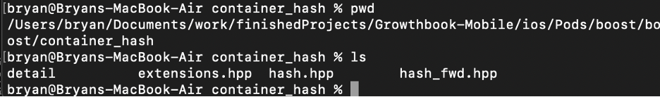
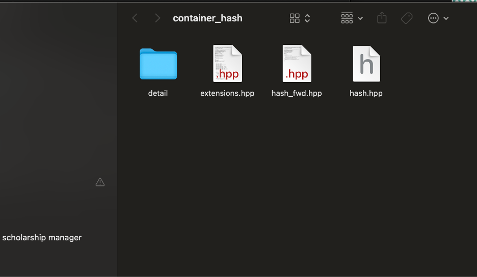
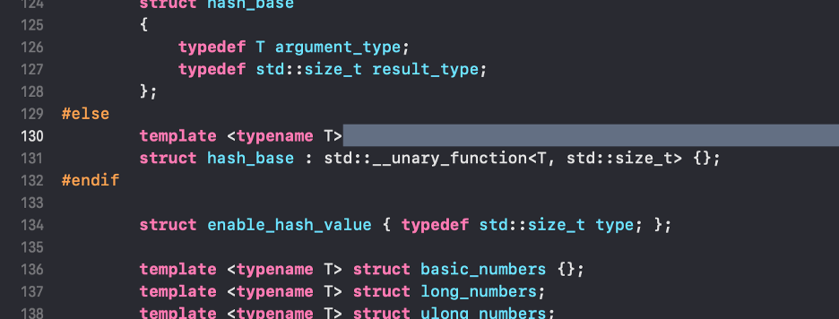
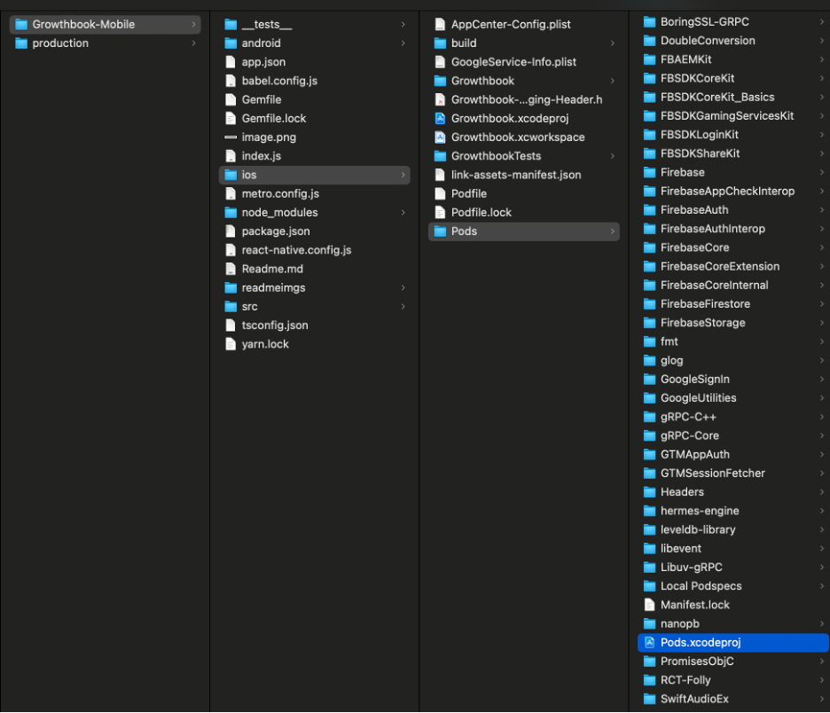
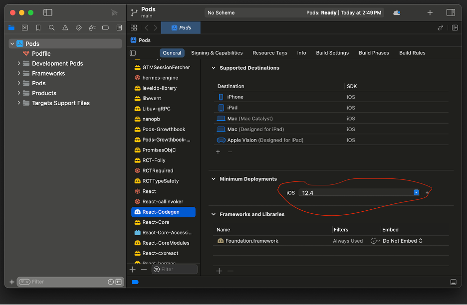

<h1>Growth-Book Configuration Guide for Mac M1 and iOS.  Developer's guide only</h1>

Welcome, Programmers!

Are you encountering issues while trying to clone the Growth-Book app on your Mac M1? Fret not! This documentation is your go-to resource for cloning any React Native repository, specifically tailored for Mac M1 with iOS. You can rest easy knowing that this guide focuses only on configuring what's inside the folder, leaving your Mac system untouched. If you make a mistake, simply delete the Git repository and re-clone it.

Descriptive Steps for Newbies:

    Open Visual Studio Code:
        Launch Visual Studio Code.

    Open the Growthbook-Mobile Directory:
        Navigate to the Growthbook-Mobile directory.

    Run Yarn Install on the Terminal:
        In the terminal, run yarn install.

    Try Yarn iOS:
        Attempt yarn ios; however, you may encounter an error. No worries; proceed with the following steps.

    Open Terminal in VSCode:
        Open your terminal in VSCode using `^+Shift+``.

    Navigate to Correct Directory:
        After opening the terminal, confirm your directory by typing pwd. You should be in Growthbook-Mobile

    Change to iOS Directory:
        Execute cd ios.

    Run Pod Install:
        Run [pod install]. If successful, green lines will indicate progress. For issues, refer to this link:https://medium.com/@julien-ctx/how-to-clone-build-and-run-a-react-native-app-from-a-github-repository-7ab781e52a14

    Retry Yarn iOS:
        Retry yarn ios. If an error persists, follow the additional steps.

    Navigate to Boost Container Hash:
        If your current directory is Growthbook-Mobile, run [cd ./ios/Pods/boost/boost/container_hash].
    You should type [ls] in your terminal and see the image below after typing cd ./ios/Pods/boost/boost/container_hash

    View Directory List:
        Type ls to view your directory list.

    Open Current Directory in Finder:
        Use [open `pwd`] to open the current directory in Finder.
    After using the open command you should see this: 

    Click on hash.hpp:
        Navigate to hash.hpp and click it.

    Modify Line 131:
        Go to line 131 and change unary_function to __unary_function.
        It should look like this:

    Address Subsequent Error:
        You may encounter another error related to pods.

    Open Pod Xcode File:
        Open the pod Xcode file at Growthbook-Mobile -> ios -> Pods -> Pods.xcodeproj.

    Configure React-Codegen:
        Scroll down and click on React-Codegen. Under Minimum Deployments, ensure iOS version is set to 12.4. If not, update it. Reference: React Native Issue #34106. https://github.com/facebook/react-native/issues/34106

    
    Retry Yarn iOS:
        Retry yarn ios. If issues persist, follow these steps.

    Return to Growthbook-Mobile Directory:
        Go back to your Growthbook-Mobile directory in the terminal/command line.

    Type Watchman Commands:
        First type: watchman watch-del-all then type: watchman shutdown-server.

    Retry and Contact for Assistance:
        Retry yarn ios and it should start to work. 

If issues persist, feel free to contact bcortes13@csudh.edu for assistance.

